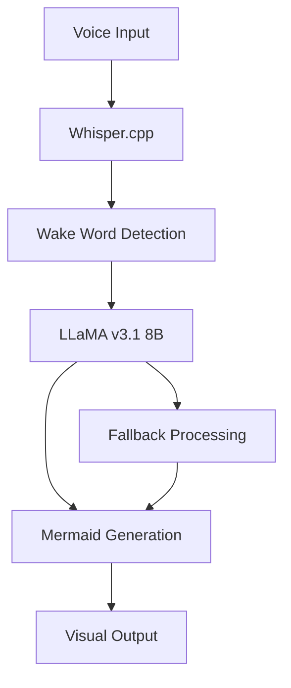

# 🎤🧠 Voice-to-Mermaid with LLaMA Integration

**Real-time voice-powered Mermaid diagram generation using Whisper.cpp and LLaMA v3.1 8B Instruct**

Convert natural language speech into beautiful Mermaid diagrams instantly with wake word detection and AI-powered understanding.

## 🎯 **Demo**

```bash
# Say: "Computer, start to process to check to end"
# Gets: 
graph TD
    Start[Start] --> Process[Process]
    Process --> Check[Check]
    Check --> End[End]
```

## 🚀 **Key Features**

- **🧠 LLaMA v3.1 8B Instruct**: Intelligent diagram generation from natural language
- **⚡ Real-time Processing**: ~0.3s speech recognition + ~1-2s diagram generation
- **🎯 Wake Word Detection**: Say "Computer" first, then your command
- **🔄 Hybrid Fallback**: Falls back to simple processing if LLaMA fails
- **🖥️ Cross-Platform**: Works on Apple Silicon (M1/M2/M3) and Windows ARM64 (Snapdragon X Elite)
- **🔒 100% Local**: No internet required, complete privacy

## 🎨 **What's New (Latest Update)**

- **🧠 LLaMA Integration**: Replaced simple text processing with AI-powered generation
- **⚡ Metal Acceleration**: Optimized for Apple Silicon performance
- **🎯 Better Accuracy**: Handles complex multi-node chains and natural language
- **🔄 Intelligent Understanding**: Understands context and creates appropriate diagrams

## 🛠️ **Quick Start**

### **Prerequisites**
- Python 3.8+
- Git with submodules
- ~8GB free space (model + dependencies)

### **Installation**
```bash
# Clone with submodules
git clone --recurse-submodules https://github.com/yourusername/voice-to-mermaid.git
cd voice-to-mermaid

# Install dependencies
pip install -r requirements.txt

# Build Whisper.cpp
cd whisper.cpp
make -j

# Download Whisper model
./models/download-ggml-model.sh base.en

# Download LLaMA model
cd ../voice-to-mermaid-llm/models
python download_model.py

# Run the system
cd ../..
python enhanced_realtime_mermaid.py
```

### **Usage**
1. **Say**: `"Computer"` (wake word)
2. **Then**: `"Draw user to database to login"`
3. **Get**: Instant Mermaid diagram!

## 📋 **Supported Commands**

| Command | Example | Output |
|---------|---------|---------|
| **Simple Chain** | `"Computer, user to database"` | `User[User] --> Database[Database]` |
| **Multi-Step Flow** | `"Computer, login to auth to dashboard"` | 3-node sequential chain |
| **Complex Process** | `"Computer, start to process to check to end"` | 4-node workflow |
| **Natural Language** | `"Computer, user authentication with database validation"` | Smart context-aware diagram |

## 🏗️ **Architecture**



## 🔧 **Technical Specifications**

### **Core Components**
- **Speech Recognition**: Whisper.cpp (base.en-q5_1 model)
- **AI Generation**: LLaMA v3.1 8B Instruct (Q4_K_M quantized)
- **Wake Word Detection**: Custom implementation
- **Real-time Processing**: Python + NumPy + SoundDevice

### **Performance**
- **Speech Recognition**: ~0.3s per 3-second chunk
- **LLaMA Generation**: ~1-2s per diagram
- **Memory Usage**: ~6GB RAM (model + buffers)
- **CPU Usage**: Optimized for ARM64 (M1/M2/M3, Snapdragon X Elite)

### **Model Details**
- **Whisper**: `base.en-q5_1` (39MB, English-optimized)
- **LLaMA**: `Q4_K_M` (4.6GB, 4-bit quantized for speed)
- **Context Window**: 2048 tokens
- **Temperature**: 0.3 (consistent output)

## 🖥️ **Cross-Platform Support**

### **Apple Silicon (M1/M2/M3)**
- **Acceleration**: Metal backend for LLaMA
- **Performance**: Optimal (1-2s generation)
- **Memory**: ~6GB RAM usage

### **Windows ARM64 (Snapdragon X Elite)**
- **Acceleration**: CPU-optimized
- **Performance**: Good (2-3s generation)
- **Memory**: ~6GB RAM usage

### **Intel/AMD x64**
- **Acceleration**: CPU + possible GPU acceleration
- **Performance**: Moderate (3-4s generation)
- **Memory**: ~6GB RAM usage

## 📁 **Project Structure**

```
voice-to-mermaid/
├── enhanced_realtime_mermaid.py    # Main voice pipeline
├── voice-to-mermaid-llm/           # LLaMA integration
│   ├── llama_mermaid.py           # LLaMA converter
│   ├── models/                    # Model files (gitignored)
│   └── test_inputs/               # Test cases
├── whisper.cpp/                   # Whisper.cpp submodule
├── scripts/                       # Helper scripts
├── requirements.txt               # Python dependencies
├── SETUP.md                       # Detailed setup guide
└── docs/                          # Additional documentation
```

## 🔄 **Version History**

### **v2.0 (Current) - LLaMA Integration**
- ✅ LLaMA v3.1 8B Instruct integration
- ✅ Metal acceleration for Apple Silicon
- ✅ Hybrid fallback system
- ✅ Cross-platform compatibility
- ✅ Enhanced natural language understanding

### **v1.0 - Basic System**
- ✅ Whisper.cpp integration
- ✅ Wake word detection
- ✅ Simple chain detection
- ✅ Real-time processing

## 🤝 **Contributing**

1. Fork the repository
2. Create a feature branch
3. Make your changes
4. Test on your platform
5. Submit a pull request

## 🧪 **Testing & Development Scripts**

The `scripts/` directory contains various tools for testing and development:

### **Core Testing**
- **`test_audio.py`**: Test microphone input and audio device setup
- **`benchmark_whisper.py`**: Performance benchmarking for Whisper models
- **`model_manager.py`**: Download and manage Whisper models

### **Pipeline Variants**
- **`simple_realtime.py`**: Basic real-time transcription (C++ version)
- **`simple_realtime_python.py`**: Basic real-time transcription (Python version)
- **`realtime_mermaid.py`**: Full voice-to-Mermaid pipeline (original)
- **`realtime_mermaid_python.py`**: Alternative Python implementation
- **`optimized_realtime.py`**: Performance-optimized version

### **Optimization Tools**
- **`optimize_base.py`**: System optimization and configuration

### **Usage Examples**
```bash
# Test your audio setup
python scripts/test_audio.py

# Benchmark Whisper performance
python scripts/benchmark_whisper.py

# Try different pipeline implementations
python scripts/realtime_mermaid.py
python scripts/optimized_realtime.py

# Performance optimization
python scripts/optimize_base.py
```

## 📚 **Documentation**

- **[SETUP.md](SETUP.md)**: Detailed cross-platform setup guide
- **[SETTINGS_SUMMARY.md](SETTINGS_SUMMARY.md)**: Configuration options
- **[optimal_config.md](optimal_config.md)**: Performance optimization
- **[voice-to-mermaid-llm/README.md](voice-to-mermaid-llm/README.md)**: LLaMA integration details

## 🐛 **Troubleshooting**

### **Common Issues**
1. **Model not found**: Download LLaMA model first
2. **Whisper compilation fails**: Check build dependencies
3. **High CPU usage**: Adjust thread count in config
4. **Memory issues**: Use smaller LLaMA model variant

### **Platform-Specific**
- **macOS**: Ensure Xcode command line tools installed
- **Windows**: Install Visual Studio Build Tools
- **Linux**: Install build-essential and cmake

## 📄 **License**

MIT License - See [LICENSE](LICENSE) file

## 🏆 **Hackathon Project**

This project was developed for a hackathon showcasing:
- **Real-time AI**: Voice → Diagram in seconds
- **Local Processing**: No cloud dependencies
- **Cross-Platform**: Works on multiple architectures
- **Practical Application**: Useful for documentation, planning, and visualization

---

**Made with ❤️ for the hackathon community** 